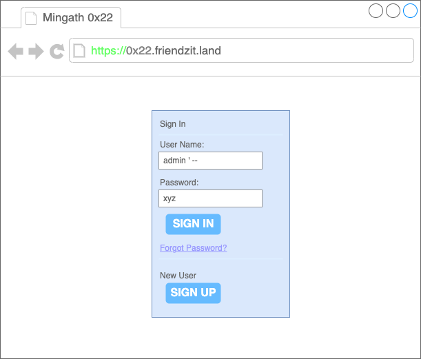
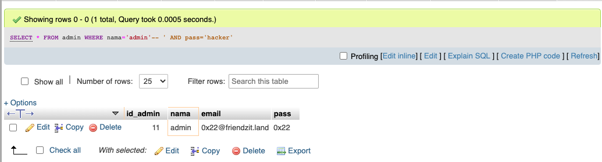

```console
zit@mingath:~$ whoami

SYUKIRMAN AMIR

        Day   :
                - Staf Zona IT Ternate
                - Staf ICT AIKOM
        Night :
                - CTF Player
                - Bug Hunter
		
	IG   :  @hackrecord
```
```console
zit@mingath:~$ ls -la

-rw-rw-rw-  1   zit     iluv    MiniGathering0x22.md    
```
```console
zit@mingath:~$ code . MiniGathering0x22.md
```


# Disclaimer
> * ### Kerentanan keamanan adalah realitas teknologi modern. Untungnya Daftar ini menyoroti bahwa peretas membantu mengurangi risiko paling serius bagi bisnis Anda..

# [10 Jenis Kerentanan Paling Berdampak dan Dihargai.](https://www.hackerone.com/top-ten-vulnerabilities)
> * ### Berikut adalah sorotan dan temuan utama dari 10 Jenis Kerentanan Paling Berdampak dan Dihargai dari HackerOne


# [ARSIP KASUS PERETASAN WEB PEMERINTAH INDOENSIA](https://medium.com/@liontin/investigating-web-defacement-in-indonesia-government-website-6fbcfa4ebdf9)
> __Warning__
> 
> Berikut Merupakan Data Investigasi Secara Mandiri **(PRIBADI)**

> * ### Berikut adalah List domain web pemerintahan yang berhasil diretas pada tahun 2021.

> * ### Berdasarkan data dari zone-H pada tahun 2021 terjadi kasus peretasan di web pemerintahan sebanyak 1122. Data ini bisa saja berbeda tergantung referensi mana yang dipakai dalam pengumpulan data.

> * ### Dari hasil pengumpulan data dapat dilihat bahwa provinsi Jawa Tengah merupakan paling **tertinggi** kasus peretasan pada tahun 2021

> * ### Berikut merupakan Rekapan Data berdasarkan bulan pada tahun 2021

> * ### Pada tahun 2021 berdasarkan dataset yang diambil dari situs [zone-h.org](http://zone-h.org/) Kasus peretasan di website pemerintahan indonesia banyak terjadi pada bagian Subdomain dengan total sebanyak 1088 di berbagai provinsi.

> __Note__
>
> Atau bisa lihat pada Laporan Tahunan Monitoring Keamanan Siber [BSSN](https://cloud.bssn.go.id/s/Lyw8E4LxwNiJoNw) tahun 2021 pada halaman **63**

# [ROAD MAP APLIKASI]()
> __Warning__
> 
> ### Sebelum kita mengenal lebih jauh tentang aksi-aksi peretasan yang marak terjadi, alangkah baiknya kita cari tau dulu kenapa sampai terciptanya celah tersebut

> * ### Seharusnya


> * ### Yang Terjadi


> * ### Hasilnya


# [Bug?](https://sl4x0.github.io/research/what-is-pentester/)
> * ### Bagaimana seseorang dapat menemukan celah keamanan?

> * ### Secara legal


> * ### Ilegal


# [Hack?]()
> * ### Sebagai contoh disini Hacker menemukan celah SQL INJECTION
> __Warning__
> 
> [SEJARAH SQL INJECTION](http://phrack.org/issues/54/8.html) dan
> [PENEMU SQL INJECTION](https://www.blackhat.com/us-13/speakers/Jeff-Forristal.html)

>  __Note__
>  
>  SQL Injection adalah sebuah serangan yang memanfaatkan celah pada aplikasi web yang melakukan Query ke dalam Database.


> * ### Normal Login

> * ### Login dengan Injeksi SQL

> * ### POC? 
```php
<?php
session_start();
include './skumpar/koneksi.php';
include('./skumpar/notif.php');
$user = $_POST['nama'];
$pass = $_POST['pass'];

$login = mysqli_query($koneksi,"select * from admin where nama='$user' and pass='$pass'");
$cek = mysqli_num_rows($login);
if($cek > 0){
$sesi = mysqli_query($koneksi,"select * from admin where nama='$user' and pass='$pass'");
$sesi = mysqli_fetch_assoc($sesi);
	$_SESSION['id'] = $sesi['id_admin'];
	$_SESSION['nama'] = $sesi['nama'];
	$_SESSION['status'] = "login";
	header("location:muacch/");
}else{
	header("location:index.php?pesan=gagal");
}

?>

```
> __Note__
> 
> Query SQL
```sql
-- Normal Query
SELECT * FROM admin WHERE nama='admin' AND pass='0x22'
```

```sql
-- Injeksi Query
SELECT * FROM admin WHERE nama='admin'--{spasi}' AND pass='hacker'
```

```sql
-- Injeksi Query 
-- Wrong
SELECT * FROM admin WHERE nama='xxx'--{spasi}' AND pass='hacker'
```

```sql
-- Injeksi Query 
-- Bypass
SELECT * FROM admin WHERE nama='xxx' OR 1=1--{spasi}' AND pass='hacker'
```

```sql
-- Logic SQL 
SELECT * FROM admin WHERE nama='xxx' OR 1=1
```


> * ### Apabila Celah keamanan Injeksi SQL telah ditutup, metode apa lagi yang akan dipakai?
> __Note__
> 
> **Broken Access Control** atau biasa disebut (BAC) mengacu ke sistem control yang mengakses informasi dan fungsionalitasnya. Access control yang bermasalah memungkinkan hacker untuk melewati proses autorisasi serta melakukan hal-hal yang biasanya hanya dapat dilakukan oleh admin.

> * ### Insecure Direct Object References **(IDOR)**
> Referensi objek langsung yang tidak aman adalah jenis kerentanan kontrol akses dalam keamanan digital. Ini dapat terjadi ketika aplikasi web atau antarmuka pemrograman aplikasi menggunakan pengenal untuk akses langsung ke objek dalam database internal tetapi tidak memeriksa kontrol akses atau otentikasi.


> * ### POC 1


> * ### POC 2

> * ### Broken Authentication dan Session Management
> Broken Authentication dan Session Management merupakan salah satu dari beberapa serangan yang dapat dilakukan oleh seseorang yang berniat jahat, biasa disebut dengan istilah hijackers, dengan memanfaatkan beberapa kelemahan pada fungsi authentification dan session management. Seringkali fungsi dari aplikasi yang berkaitan dengan authentification dan session management tidak diimplementasikan dengan tepat dan sempurna, dalam hal ini dapat menyebabkan aplikasi rentan untuk diserang dengan memanfaatkan passwords, session token, dll
> * ### Logic

> * ### Broken

# MINDMAPS 
https://blog.it-securityguard.com/pbbt.svg

https://gowthams.gitbook.io/bughunter-handbook/mindmaps

