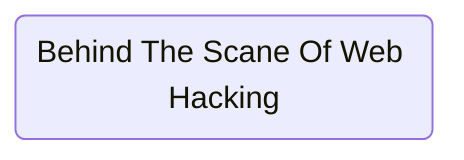
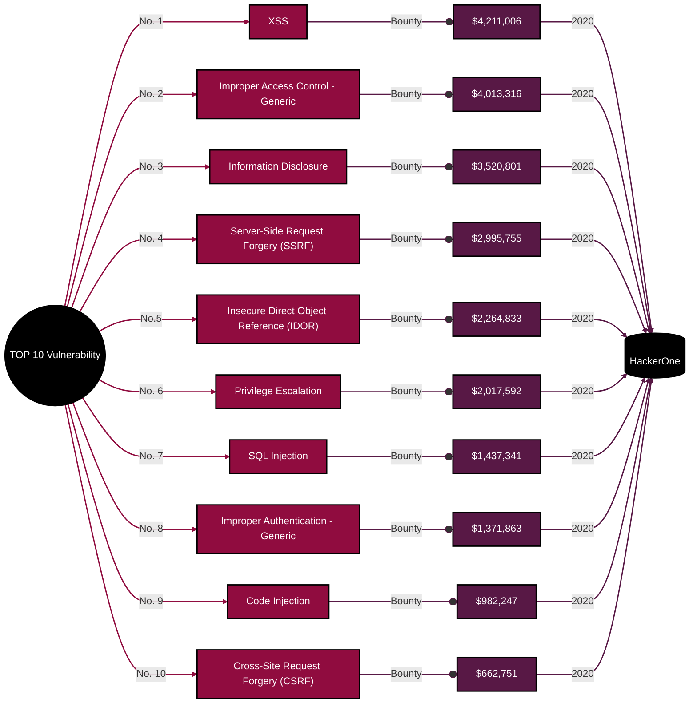
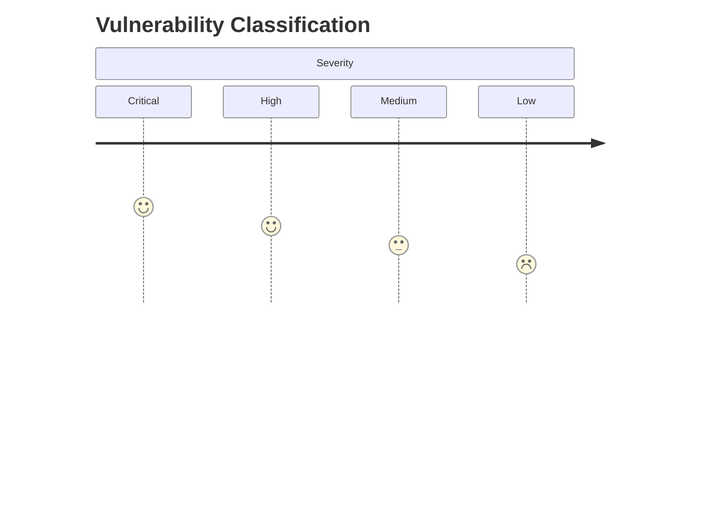
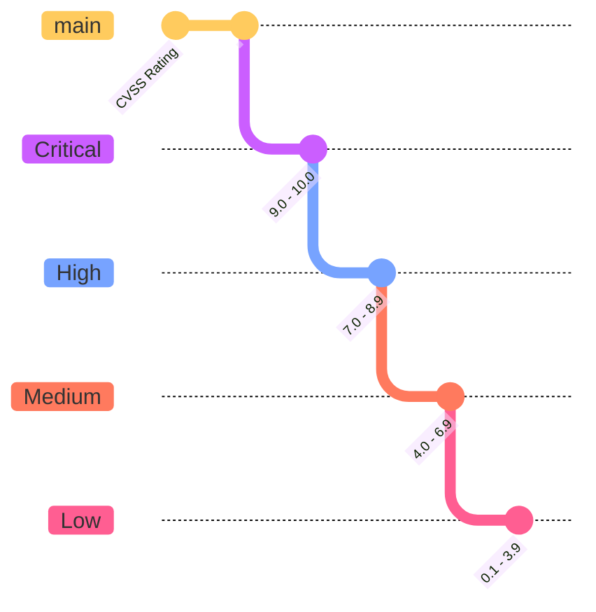

```console
zit@mingath:~$ whoami

SYUKIRMAN AMIR

        Day   :
                - Staf Zona IT Ternate
                - Staf ICT AIKOM
        Night :
                - CTF Player
                - Bug Hunter
```
```console
zit@mingath:~$ ls -la

-rw-rw-rw-  1   zit     iluv    MiniGathering0x22.md    
```
```console
zit@mingath:~$ code . MiniGathering0x22.md
```



```mermaid
```console
zit@mingath:~$ whoami

SYUKIRMAN AMIR

        Day   :
                - Staf Zona IT Ternate
                - Staf ICT AIKOM
        Night :
                - CTF Player
                - Bug Hunter
```
```console
zit@mingath:~$ ls -la

-rw-rw-rw-  1   zit     iluv    MiniGathering0x22.md    
```
```console
zit@mingath:~$ code . MiniGathering0x22.md
```




